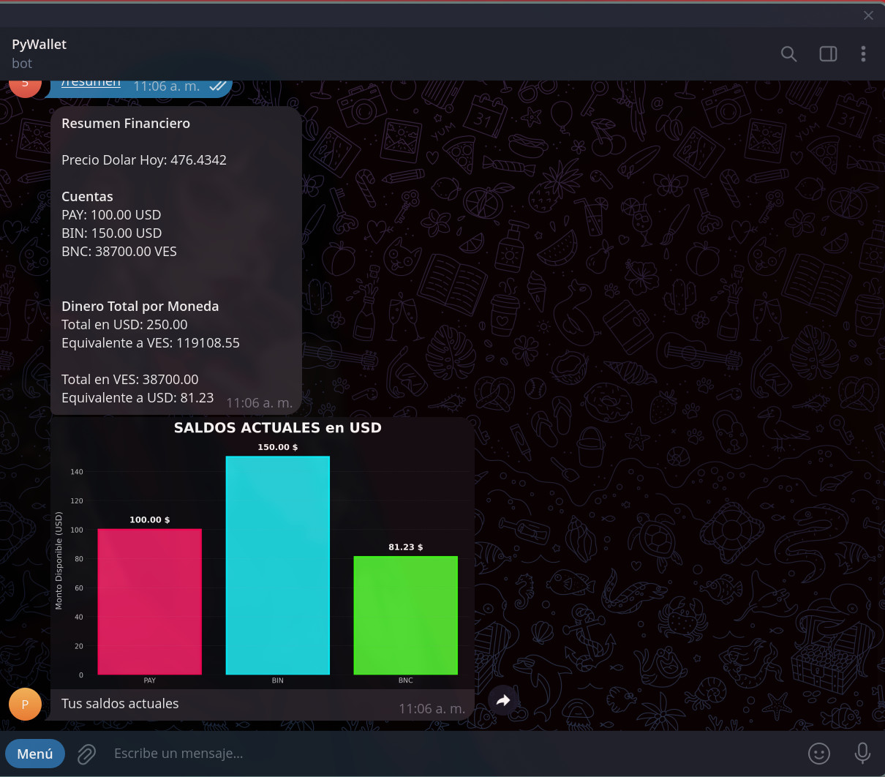
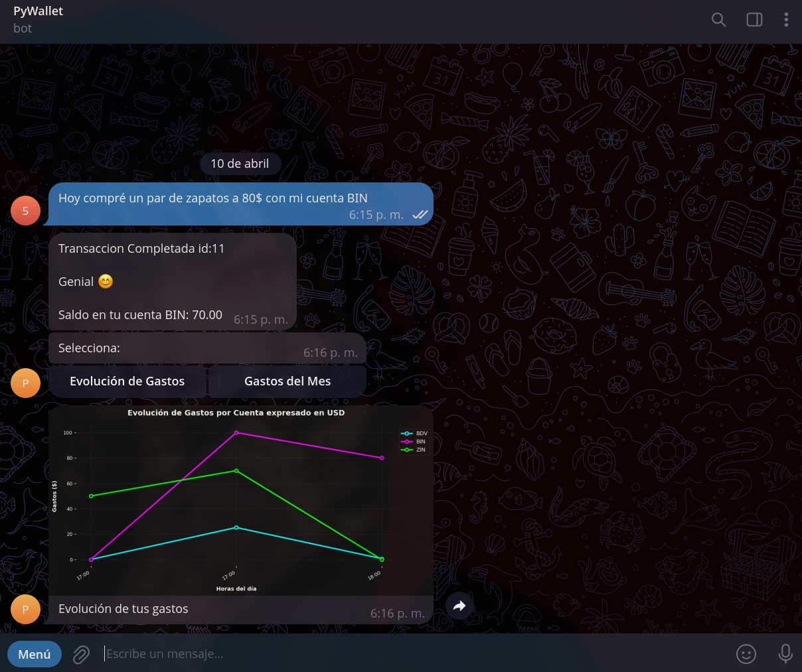
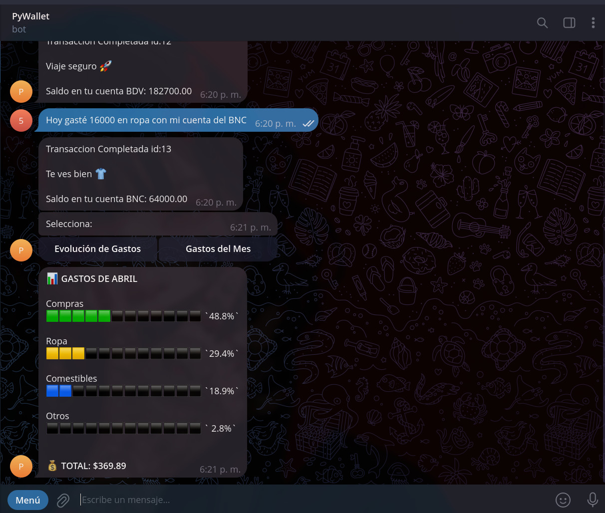

<h1 align="center">
  🤖 PyWallet - Billetera Digital Inteligente
</h1>

<p align="center">
  Una billetera digital inteligente operada a través de Telegram que utiliza Inteligencia Artificial (GroqAPI) para procesar transacciones en lenguaje natural, gestionar cuentas y generar reportes visuales de finanzas.
</p>

<p align="center">
  
  
  
  
  
  
</p>

## Sobre el Proyecto



**PyWallet** nació de la necesidad de registrar gastos diarios sin lidiar con interfaces complejas. El usuario simplemente envía un mensaje como: *"Gasté 20$ en el supermercado usando la cuenta BNC"*, y el bot, impulsado por la API de Groq (LLaMA), extrae los datos, estructura un JSON y registra la transacción en la base de datos de forma asíncrona.

Este proyecto fue desarrollado con un enfoque en Arquitectura Limpia, concurrencia y buenas prácticas de ingeniería de software.

## Características Principales

- **Procesamiento de Lenguaje Natural (NLP):** Convierte texto escrito en lenguaje natural a JSON gracias a la IA para operaciones de transacciones.
- **Arquitectura Asíncrona:** Construido con `Aiogram 3` y `SQLAlchemy Async`, lo que garantiza un alto rendimiento y concurrencia sin bloqueos.
- **Visualización de Datos:** Generación de gráficas financieras dinámicas (Evolución de gastos, saldos por cuenta) utilizando `Pandas`, `Matplotlib` y `Seaborn` (ejecutados en hilos diferentes para evitar bloquear el bot)
- **Control de Acceso (Middlewares):** Cuenta con un sistema de autenticación de usuarios mediante middlewares de Telegram. Solo usuarios pre-aprobados por el administrador pueden interactuar con el bot.
- **Máquinas de Estado (FSM):** Flujos conversacionales complejos para la creación de cuentas y filtrado de historiales.
- **Despliegue Contenerizado:** Entorno completamente dockerizado utilizando `Docker Compose` para levantar la aplicación y la base de datos al mismo tiempo.

---

## Arquitectura y Estructura del Proyecto

El proyecto sigue una arquitectura modular, separando responsabilidades para facilitar la escalabilidad y el mantenimiento:

```text
.
├── alembic/                # Migraciones de Base de Datos
├── app/
│   ├── bot/                # Configuración principal del bot y catchers de errores globales
│   ├── db/                 # Configuración del motor asíncrono y sesión de BD
│   ├── handlers/           # Lógica de negocio y controladores de comandos
│   │   ├── FSM/            # Estados de las conversaciones (Finite State Machines)
│   │   └── utils/          # Lógica de gráficas, exportación a CSV y APIs externas (Dólar)
│   ├── IA/                 # Integración con LLM (Groq API) y diseño de prompts
│   ├── middleware/         # Interceptores de peticiones (Inyección de DB, Autenticación)
│   ├── models/             # Modelos ORM (SQLAlchemy)
│   └── schemas/            # Validación de datos con Pydantic
├── docker-compose.yml      # Orquestación de contenedores
├── Dockerfile              # Construcción de la imagen de la app
├── main.py                 # Entrypoint de la aplicación
│── requirements.txt        # Dependencias del proyecto
└── .env                    # Variables de entorno (ID de admin, Tokens,URL de bases de datos)
 ```

## Instalación y Despliegue (Docker)

Gracias a Docker, desplegar el bot en cualquier entorno es un proceso rápido.

### Requisitos previos

Docker y Docker Compose instalados.

Un token de Bot de Telegram (Obtenido vía BotFather).

Una API Key de Groq.

### Pasos

Clonar el repositorio:

  git clone [https://github.com/TU_USUARIO/pywallet.git](https://github.com/TU_USUARIO/pywallet.git)
  cd pywallet

#### Configurar las variables de entorno

Crea un archivo .env en la raíz del proyecto basándote en las siguientes variables:

Fragmento de código

  TOKEN=tu_token_de_telegram
  API_KEY=tu_api_key_de_groq
  DATABASE_URL=postgresql+asyncpg://user:password@db:5432/pywallet_db
  ADMIN_ID=tu_telegram_id_personal
  API_DOLAR=url_api_bcv

Levantar los contenedores:

  docker-compose up -d --build
  Aplicar migraciones de Base de Datos:

  docker-compose exec app alembic upgrade head

## Demostración de Uso

Ingreso de datos con IA y Visualización de finanzas




## Autor y Contacto

Desarrollado con dedicación para consolidar conocimientos en desarrollo Backend moderno.

LinkedIn: [Alejandro Moncada](https://www.linkedin.com/in/alejandroxyz/)

Email: <alejandromdekuedit@gmail.com>
